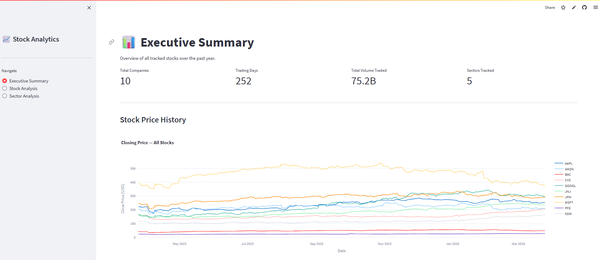
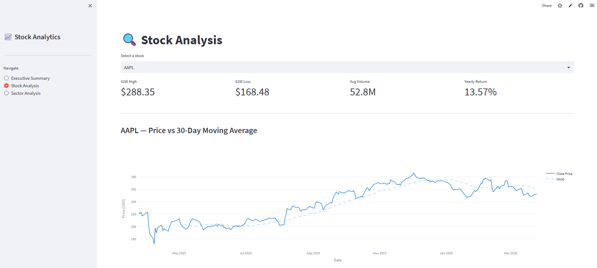
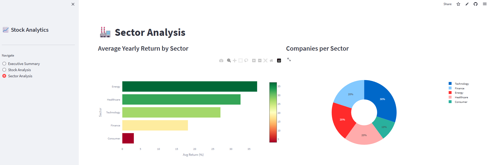
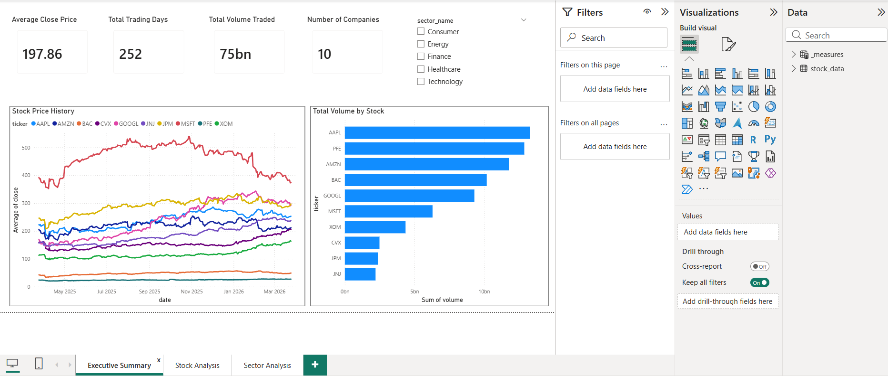
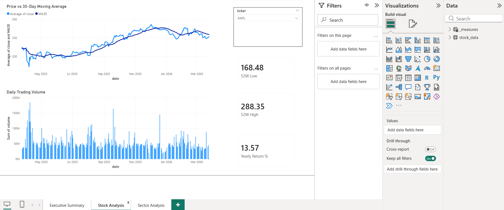

# 📈 Stock Market Analytics Platform

An end-to-end data analytics platform that ingests real-time stock market data from Yahoo Finance, stores it in a cloud PostgreSQL database, and presents insights through an interactive live web app and Power BI dashboard.

**🔗 Live App:** [stock-analytics-platform-fm6mqjqbgz6vvyqwbwvt6f.streamlit.app](https://stock-analytics-platform-fm6mqjqbgz6vvyqwbwvt6f.streamlit.app)

---

## 📊 Key Findings

- **Energy sector** delivered the highest yearly return (~35%), driven by strong performance from CVX and XOM
- **MSFT** dropped the furthest from its 52-week high (-30%), signaling a significant correction over the year
- **Consumer sector** (AMZN) recorded the lowest yearly return despite having the highest average daily trading volume
- **Friday** consistently shows the highest trading volume across all stocks — traders are most active at end of week
- **Technology and Healthcare** sectors showed strong mid-range returns, making them stable investment candidates

---

## 🏗️ Architecture

```
Yahoo Finance API
       ↓
  Python ETL Script  ──── runs daily, fetches fresh prices
       ↓
 Supabase PostgreSQL  ─── 3 related tables, cloud hosted
       ↓
 Streamlit Web App   ─── live public URL, reads from DB
 Power BI Dashboard  ─── executive reporting layer
```

---

## 🛠️ Tools & Technologies

| Layer | Tool |
|---|---|
| Data Ingestion | Python, yfinance |
| Database | PostgreSQL (Supabase) |
| Analysis | Python, Pandas, Plotly |
| Web App | Streamlit (deployed on Streamlit Cloud) |
| Dashboard | Power BI |
| Version Control | Git, GitHub |

---

## 📁 Project Structure

```
stock-analytics-platform/
│
├── analysis/
│   └── stock_analysis.ipynb    # EDA with 7 analyses and findings
│
├── app/
│   └── app.py                  # Streamlit web app (3 pages)
│
├── database/
│   ├── schema.sql              # 3 table definitions with foreign keys
│   └── queries.sql             # 7 business analysis SQL queries
│
├── ingestion/
│   └── fetch_and_load.py       # ETL pipeline — Yahoo Finance → PostgreSQL
│
├── screenshots/                # App and dashboard screenshots
│
├── requirements.txt
└── README.md
```

---

## 🗄️ Database Schema

Three related tables with proper foreign keys — designed to mirror real company data architecture:

```sql
sectors      → sector_id, sector_name
companies    → ticker, company_name, sector_id (FK → sectors)
stock_prices → id, ticker (FK → companies), date, open, close, high, low, volume
```

**10 companies tracked across 5 sectors:**
- Technology: AAPL, MSFT, GOOGL
- Finance: JPM, BAC
- Healthcare: JNJ, PFE
- Energy: XOM, CVX
- Consumer: AMZN

---

## 📸 Streamlit App

### Executive Summary


### Stock Analysis


### Sector Analysis


---

## 📸 Power BI Dashboard

### Executive Summary


### Sector Analysis


---

## ⚙️ Setup & Installation

1. Clone the repository
```bash
git clone https://github.com/yokubbakhodirov/stock-analytics-platform.git
cd stock-analytics-platform
```

2. Install dependencies
```bash
pip install -r requirements.txt
```

3. Create a `.env` file in the root folder
```
DATABASE_URL=your_supabase_postgresql_connection_string
```

4. Run the ETL pipeline to load stock data
```bash
python ingestion/fetch_and_load.py
```

5. Launch the web app locally
```bash
streamlit run app/app.py
```

---

## 👤 Author
Yokub Bakhodirov — [LinkedIn](https://linkedin.com/in/yourprofile) | [GitHub](https://github.com/yokubbakhodirov)
